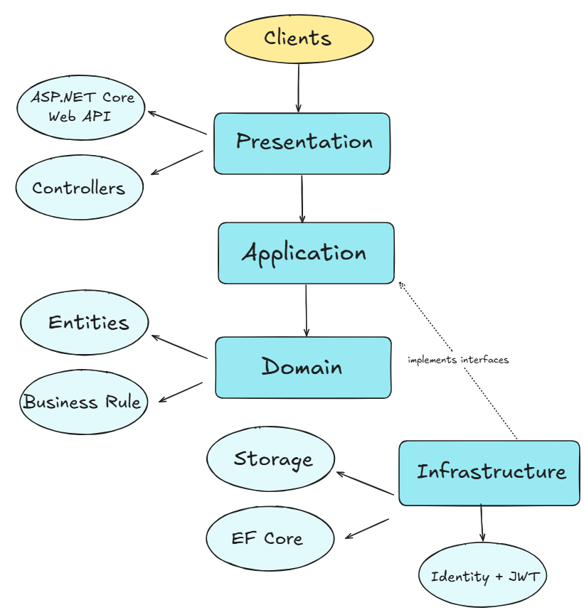
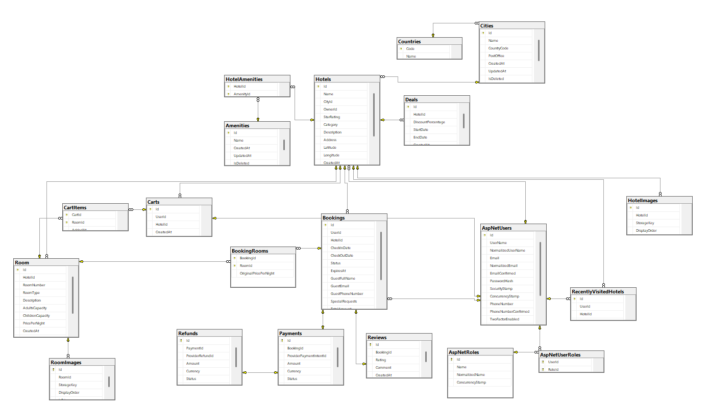

# Hotel Booking System API

A backend API for an online hotel booking platform built with ASP.NET Core and .NET.

The system provides the core functionality required for a hotel booking application, including authentication and authorization, hotel and room management, hotel search and filtering, room availability, booking and checkout workflows, payment processing, recently visited hotels, featured deals, trending destinations, and administrative operations.

The project is designed with a clear separation of responsibilities across the API, Application, Domain, and Infrastructure layers.

---

## Table of Contents

- [Overview](#overview)
- [Key Features](#key-features)
- [Architecture](#architecture)
  - [Project Structure](#project-structure)
  - [Request Flow](#request-flow)
- [Technology Stack](#technology-stack)
- [Database Design](#database-design)
- [API Overview](#api-overview)
- [Testing & Performance](#testing--performance)
- [Getting Started](#getting-started)
  - [Configuration](#configuration)
  - [Running with Docker](#running-with-docker)
- [CI/CD & Deployment](#cicd--deployment)
- [Design Decisions & Trade-offs](#design-decisions--trade-offs)
  
---

  ## Overview

The **Hotel Booking System** is a backend REST API designed to support the main workflows of an online hotel booking platform.

The system allows users to search for hotels and available rooms, explore hotel details, create bookings, complete checkout and payment, and review their booking information. It also provides personalized functionality such as featured deals, recently visited hotels, and trending destinations.

In addition to customer-facing functionality, the system provides administrative capabilities for managing cities, hotels, rooms, users, and hotel ownership.

The project focuses on building a maintainable and reliable backend by separating business logic from infrastructure concerns and applying clear architectural boundaries between the API, Application, Domain, and Infrastructure layers.

---
## Key Features

### Authentication & Authorization
- User registration and login.
- JWT-based authentication.
- Role and permission-based access control.
- Administrative user management.

### Hotel Discovery
- Search for hotels by destination and booking criteria.
- Filter hotels by price, rating, amenities, and other supported criteria.
- Browse hotel details, available room types, images, and pricing.
- Featured hotel deals.
- Recently visited hotels for authenticated users.
- Trending destinations based on platform activity.

### Booking & Checkout
- Check room availability for selected dates.
- Create and manage hotel bookings.
- Calculate booking totals based on selected rooms and stay duration.
- Support checkout and payment workflows.
- Booking confirmation and invoice-related processing.

### Payments & Notifications
- Payment processing integration.
- Payment status handling as part of the booking workflow.
- Email notifications related to booking and payment events.

### Hotel Management
- Manage cities, hotels, rooms, room types, amenities, and related hotel information.
- Support hotel ownership and owner-specific operations.
- Manage hotel and room images.


### Reliability & Engineering
- Centralized error handling.
- Request validation.
- Structured application logging.
- Caching for selected read operations.
- Rate limiting.
- Health checks.
- Automated unit and integration testing.
- Docker support and CI/CD workflows.

  ---

 ## Architecture

The project follows **Clean Architecture principles**, separating the system into four main layers: Presentation, Application, Domain, and Infrastructure.

The main goal of this architecture is to keep the core business logic independent from frameworks, databases, and external services.

- **Presentation Layer**  
  Contains the ASP.NET Core Web API and controllers. It is responsible for receiving HTTP requests, validating the request boundary, and delegating work to the Application layer.

- **Application Layer**  
  Contains the application's use cases and coordinates business workflows. It defines abstractions for infrastructure concerns and depends on the Domain layer.

- **Domain Layer**  
  Contains the core business entities and business rules. It represents the heart of the system and remains independent from infrastructure and framework-specific implementations.

- **Infrastructure Layer**  
  Contains implementations for persistence, authentication, external services, file storage, and other technical concerns. It implements abstractions defined by the inner layers.

This dependency direction follows the Dependency Inversion Principle: inner layers do not depend on infrastructure details, while the Infrastructure layer depends on abstractions exposed by the Application layer.

<p align="center">
  
</p>

---
### Project Structure

The solution structure reflects the Clean Architecture layers, while application use cases are organized by feature to keep related functionality together.

```text
HotelBookingSystem/
│
├── src/
│   ├── HotelBooking.Api/              # API endpoints, controllers, middleware, and API configuration
│   │
│   ├── HotelBooking.Application/      # Application use cases organized by feature
│   │   ├── Authentication/            # Login, registration, and authentication workflows
│   │   ├── Bookings/                  # Booking and checkout use cases
│   │   ├── Hotels/                    # Hotel-related commands and queries
│   │   ├── Rooms/                     # Room-related operations
│   │   ├── Cities/                    # City management operations
│   │   └── Common/                    # Shared application abstractions and behavior
│   │
│   ├── HotelBooking.Domain/           # Core entities, domain rules, and domain concepts
│   │
│   └── HotelBooking.Infrastructure/   # Database, Identity, external services, storage, and integrations
│
├── tests/
│   ├── HotelBooking.UnitTests/        # Isolated tests for application and domain behavior
│   └── HotelBooking.IntegrationTests/ # API, database, and infrastructure integration tests
│
├── docs/
│   └── images/                        # Architecture and database diagrams
│
├── .github/
│   └── workflows/                     # CI/CD workflow definitions
│
├── docker-compose.yml                 # Multi-container development configuration
├── Dockerfile                         # Application container definition
└── README.md                          # Project documentation
```

The **Application layer follows a feature-based organization**, where commands, queries, handlers, validators, and related models for the same business capability are kept together rather than being separated by technical type.

This makes individual use cases easier to locate, understand, test, and maintain as the system grows.
---- 
### Request Flow

A typical request flows through the system in the following sequence:

1. The client sends an HTTP request to the API.
2. The request reaches the appropriate controller in the Presentation layer.
3. The controller delegates the operation to the Application layer.
4. The corresponding command or query handler executes the use case.
5. Domain rules are applied where required.
6. Infrastructure services are used through abstractions for concerns such as database access, authentication, storage, payments, or external integrations.
7. The result is returned back through the API as an HTTP response.

---
## Technology Stack

The project is built with the following technologies:

| Area | Technology |
|---|---|
| Backend | ASP.NET Core Web API |
| Language | C# |
| Runtime | .NET |
| Database | SQL Server |
| ORM | Entity Framework Core |
| Authentication | ASP.NET Core Identity + JWT |
| Authorization | Role and permission-based authorization |
| Payments | Stripe |
| File Storage | Azure Blob Storage |
| Email | SMTP |
| External Location Services | Geoapify |
| Caching | ASP.NET Core caching mechanisms |
| Background Processing | Hosted background services |
| Logging | Structured logging |
| Testing | Unit and Integration Tests |
| Containerization | Docker & Docker Compose |
| CI/CD | GitHub Actions |
---
## Database Design

The system uses a relational database to model the main hotel booking concepts and their relationships.

The database design covers the core entities required by the platform, including users, hotels, rooms, bookings, cities, amenities, payments, and related supporting data.

The schema is designed to maintain clear relationships between entities and support the main application workflows such as hotel search, room availability, booking creation, payment processing, and administration.

<p align="center">
  
</p>
---


## API Overview

The Hotel Booking System exposes RESTful API endpoints that cover the main workflows of the platform, including authentication, hotel discovery, room management, bookings, payments, user operations, and administrative functionality.

The API is organized by business capability to keep the endpoints clear, maintainable, and easy to explore.

### API Documentation

The available endpoints can be explored and tested using both **Swagger UI** and a **public Postman collection**.

#### Swagger UI

Swagger provides interactive API documentation and allows requests to be tested directly from the browser while the application is running.

```text
/swagger
```

#### Postman Collection

A public Postman collection is available for exploring the API, testing requests, and reviewing request/response examples.

[View Public Postman Collection](https://advancesoft-team.postman.co/documentation/43119323-d950a4d6-3dfa-4f52-a052-aa5849996b0e/publish?workspaceId=054b4372-6b5a-49d5-98c9-b4a1118fcf94&authFlowId=d6ff2767-43a9-4f15-86c4-477f62fd99da&_pmt=pmtMTc4NjQ3MDM0ODkyNg%253D%253D%257CPM.MjAyNi0wOC0xMVQxNzo0NTowNy4xMTha)

---

## Testing & Performance

The project includes automated tests to verify application behavior, integration between components, and critical booking scenarios.

### Unit Tests

Unit tests focus on isolated business and application behavior, including:

- Command and query handlers.
- Validation rules.
- Business logic.
- Error and edge-case scenarios.
- Authorization-related behavior where applicable.

### Integration Tests

Integration tests verify that multiple parts of the system work correctly together, including:

- API endpoints.
- Database interactions.
- Authentication and authorization flows.
- Booking workflows.
- Payment-related scenarios.
- Infrastructure integrations.

### Concurrency & Performance Scenarios

Critical booking operations are tested with attention to concurrency and performance-sensitive behavior, especially where multiple requests may compete for the same room availability.

The goal is to verify correctness under realistic conditions and reduce the risk of issues such as duplicate or conflicting bookings.

### Running the Tests

Run all tests using:

```bash
dotnet test
```
---
## Getting Started

Follow the steps below to run the Hotel Booking System locally.

### Prerequisites

Make sure the following tools are installed:

- [.NET 10 SDK](https://dotnet.microsoft.com/download)
- SQL Server
- Docker and Docker Compose *(optional, for containerized setup)*

### Clone the Repository

```bash
git clone (https://github.com/AfafNasr/HotelBookingSystem)
cd HotelBookingSystem
```

### Restore Dependencies

Restore the NuGet packages for the solution:

```bash
dotnet restore
```

### Configuration

Before running the application, configure the required application settings.

The project requires configuration for services such as:

- Database connection
- JWT authentication
- Stripe payments
- Email service
- Azure Blob Storage
- Geoapify

Sensitive values such as passwords, API keys, tokens, and connection strings should not be committed to source control.

For local development, provide the required values through the appropriate development configuration or environment variables.

### Apply Database Migrations

Apply the Entity Framework Core migrations to create or update the database:

```bash
dotnet ef database update
```

### Run the Application

Start the API using:

```bash
dotnet run --project src/HotelBooking.Api
```

Once the application is running, the API documentation can be accessed through Swagger:

```text
/swagger
```

### Running with Docker

The application can also be started using Docker Compose:

```bash
docker compose up --build
```

To stop the containers:

```bash
docker compose down
```
---
## CI/CD & Deployment

The project uses **Docker** and **GitHub Actions** to support consistent builds, automated testing, and deployment.

### Docker

Run the application using Docker Compose:

```bash
docker compose up --build
```

### GitHub Actions

CI/CD workflows are located in:

```text
.github/workflows/
```

They automate the main pipeline steps, including build, test, and deployment-related tasks.

### Live Deployment

The API is deployed on **Azure Container Apps**.

[Open Live Swagger UI](https://hotelbooking-api-final.lemonbay-83f05f5b.uaenorth.azurecontainerapps.io/swagger/index.html)

### Azure Storage

Hotel, city, and related application images are stored in **Azure Blob Storage**, keeping media files outside the application and database while allowing them to be accessed through the deployed system.

---

## Design Decisions & Trade-offs

Several design decisions were made to keep the system maintainable, testable, and practical without introducing unnecessary complexity.

### Clean Architecture

The project follows **Clean Architecture principles** to separate business logic from infrastructure and framework-specific concerns.

This improves maintainability and testability, but introduces additional project structure and abstraction compared with a simpler layered application.

### Feature-Based Application Structure

Application use cases are organized by feature rather than only by technical type.

This keeps related commands, queries, handlers, and validation logic close together and makes features easier to locate and maintain as the project grows.


### External Service Integrations

External concerns such as payments, file storage, email, and location-related functionality are kept behind application abstractions.

This reduces coupling between the business logic and third-party providers and makes those integrations easier to replace or test.

### Single Deployable Application

The system is implemented as a single backend application rather than using microservices.

For the current scope, this keeps development, testing, deployment, and data consistency simpler while still maintaining clear internal boundaries between responsibilities.


